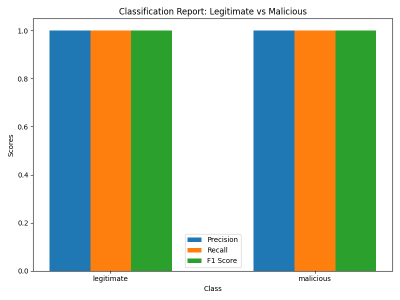

# CAP-5150-Antivirus-Scanner
The CAP-5150 Antivirus Scanner is a research project focused on detecting malicious PDF files using Machine Learning (ML) techniques. This project aims to design and evaluate an antivirus scanner capable of analyzing and classifying potentially harmful PDFs based on various features extracted from the files.

The primary components of this project involve dataset preparation, feature extraction, machine learning model training/testing, and performance evaluation. The application is designed for research and educational purposes.

Presentation Link: https://youtu.be/LnyDybWbbqM 

Demo Link: https://drive.google.com/file/d/1q5p7BUDAg-QZcYL2XiQrOhpzirm_4GeG/view?usp=share_link

## Obtaining Malicious PDFs:

This project uses a dataset of PDF files, which may contain both benign and malicious files. The dataset can be customized and pre-processed to extract relevant features for model training.
https://www.unb.ca/cic/datasets/pdfmal-2022.html (Only download and use in sandbox environment! Link at bottom of page)

## Sandbox Environment:
[Cuckoo](https://cuckoosandbox.org/)

## Install Python Libraries: 

Libraries that will be beneficial for this project are: numpy, pandas, scikit-learn, matplotlib, pymupdf, yara-python, cuckoo (can be installed through terminal along with python parsing libraries)

Libraries can be installed by running the following command in the `main` directory 
> `pip3 install -r requirements.txt`

> `pip install -r requirements.txt`

## Executing the Software: 

1. Navigate to the `main` directory 

    > `cd logisticRegression`

2. Execute the following command:

    > `./scanPDF.sh`

*NOTE: The scanPDF script may need be altered to satisfy system requirements. Currently the script is configured to use pip and python*
Here's a detailed README file for the GitHub repository project **CAP-5150-Antivirus-Scanner**:

---

## Feature Extraction
Feature extraction involves parsing PDF files to identify specific attributes that are indicative of malicious behavior. Features may include:
- Metadata information (e.g., author, modification date)
- JavaScript presence
- Number of objects or streams
- Embedded files

### Customization
Modify the `feature_extraction.py` script to customize the extracted features based on your specific requirements.

---

## Machine Learning:

`machineLearningModel.py` is used to train the machine learning models and generate the pickle files used in `main.py`

`machineLearningModel.py` utilizes a dataset from the [CIC-Evasive-PDFMal2022 Dataset](https://www.unb.ca/cic/datasets/pdfmal-2022.html) that contains data designed for research and development for malware detection and analysis. 

The dataset includes binary files of malware, along with legitimate PDFs for training purposes.

The script produces a Classification Report explaining the results of the data through precision, recall, f1-score, and support. 

The script also produces a Confusion Matrix showing the number of files that are True Positive, False Positive, False Negative, and False Positive.

These metrics can be found in the model_images folder after running the training.py file. 

1. Precision: measures the accuracy of positive predicitions. Precision is measured by the number of true positives divided by the sum of true positives and false positives. 

2. Recall: measures the ability of the model to find all the positive cases; explains how many of the actual positives were identified correctly. Recall is measured by the number of true positives divided by the sum of true positives and false negatives. 

3. F1-Score: measures the mean of precision and recall; provides a score that balances precision and recall. 

4. Support: measures the number of instances of each class of the dataset. For example, in the classification report shown below, the number of legitimate files in the test dataset was 19,250 files. 

